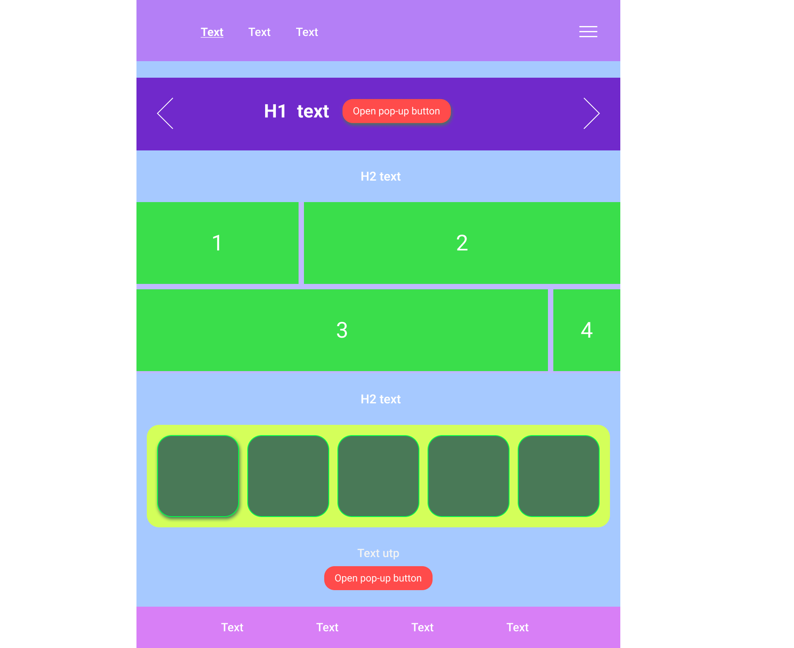
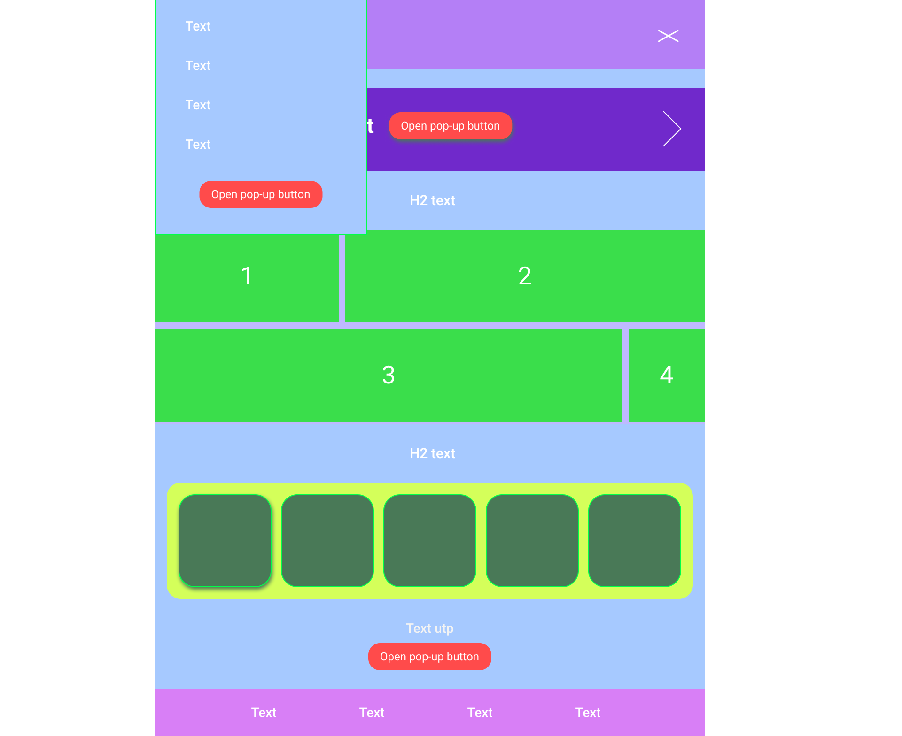

# Тестовое задание от [Qupe](https://qupe.ru/) 

Задание (прямая цитата):
> [ссылка на макет в Figma](https://www.figma.com/file/1p1wCs1y8E0dKvReLwYdKp/Test-task?node-id=0%3A1)
>
> Вёрстка должна быть с использованием препроцессора.
> Модальная форма должна быть свёрстана и заскриптована самостоятельно, без использования библиотек.
> Модальная форма должна иметь полупрозрачную подложку, позиционирована по центру экрана.
> В вёрстке макета не должны быть использованы фреймворки.
> Вёрстка должна быть адаптивна (по Вашему усмотрению) и кроссбраузерна.
>Итогом задания: Ссылка на задание и затраченное время.

Затрачено времени: ~8 часов

Личное мнение о выполнении задания: сверстал пиксель в пиксель, сделал быстро и получил наслаждение от своей работы

Вердикт компании (прямая цитата): 
> Ответ от руководства, подробный, прошу не воспринимать как попытку обидеть:
>
> Не используется конструкция midia hover на ссылках. БЭМ не используется, да в ректе css модули, но здесь лучше по БЭМ. Хотя вижу шаблонизатор PUG, но у нас такого требования нет.
> Бургер не закрывается при клике вне его области. Адаптива, который был бы продуман как нужно - нет. Зачем везде гриды, даже там где это не нужно? Да, сейчас он хорошо поддерживается, ранее была с ним беда, но гридовать все подряд не лучшая практика, не считаю как за ошибку, просто мысли в слух.
> Было бы не плохо подтянуть верстку, а затем переходить к изучению фреймворков и библиотек.
> По этой обратной связи не смогу предложить дальнейшее прохождение этапов собеседования.

